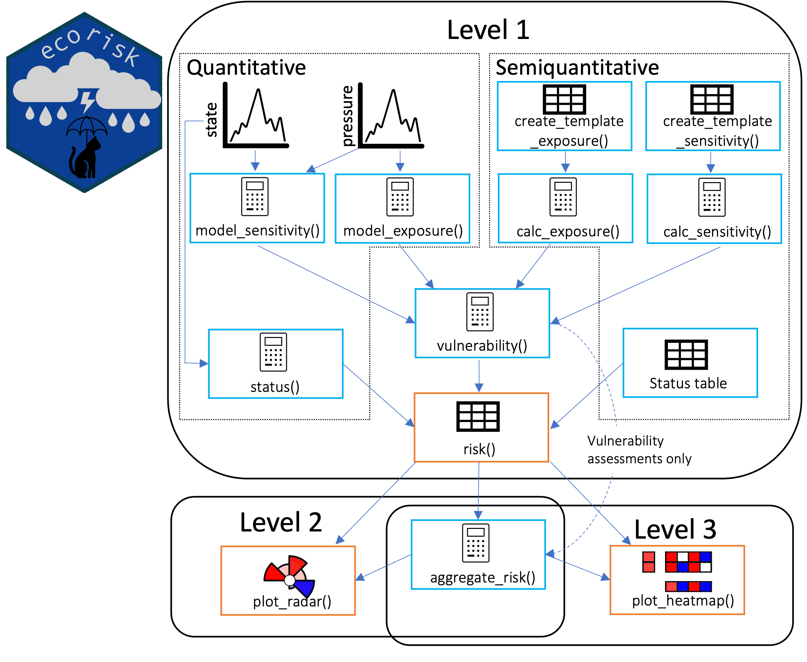

<!-- README.md is generated from README.Rmd. Please edit that file -->

# ecorisk 

<!-- badges: start -->

[](https://cran.r-project.org/package=ecorisk)
[](https://github.com/HeleneGutte/ecorisk/actions/workflows/R-CMD-check.yaml)
[](https://cran.r-project.org/package=ecorisk)
[](LICENSE)
[](https://doi.org/10.1016/j.softx.2026.102612)
<!-- badges: end -->

## Overview

*ecorisk* is an R package operationalizing a modular risk assessment
framework for ecosystem-based management. It supports semiquantitative
expert scoring approaches as well as quantitative time-series analysis —
and allows both to be combined in one integrated assessment.

Key features:

- Risk assessments from single indicator–pressure combinations up to
  full ecosystem scale
- Integration of expert knowledge and time-series modelling in one
  framework
- Explicit uncertainty assessment throughout all steps
- Applicable to marine and terrestrial ecosystems
- Publication-ready visualizations via `plot_radar()` and
  `plot_heatmap()`

The *ecorisk* workflow consists of two parallel pathways (expert scoring
and modelling) that are joined for vulnerability and risk calculation,
and can then be aggregated to multi-pressure, multi-indicator, and
ecosystem risk scores:



## Installation

Install the released version from CRAN:

``` r
install.packages("ecorisk")
```

Or install the development version from GitHub using the `pak` package:

``` r
# install.packages("pak")
pak::pak("HeleneGutte/ecorisk")
```

## Usage

A full tutorial using the provided demo datasets is available in the
package vignette:

``` r
vignette("ecorisk")
```

Further background on the risk assessment framework and step-by-step
function documentation are available on the [package
website](https://helenegutte.github.io/ecorisk/).

## Citation

If you use the *ecorisk* package, please cite it using:

``` r
citation("ecorisk")
#> To cite package 'ecorisk' in publications use:
#> 
#>   Gutte H, Otto S (2026). _ecorisk: Risk Assessments for Ecosystems or
#>   Ecosystem Components_. R package version 0.3.1,
#>   <https://github.com/HeleneGutte/ecorisk>.
#> 
#> A BibTeX entry for LaTeX users is
#> 
#>   @Manual{,
#>     title = {ecorisk: Risk Assessments for Ecosystems or Ecosystem Components},
#>     author = {Helene Gutte and Saskia A. Otto},
#>     year = {2026},
#>     note = {R package version 0.3.1},
#>     url = {https://github.com/HeleneGutte/ecorisk},
#>   }
```

If you use the *ecorisk* framework or methodology, please also cite the
accompanying software paper:

> Gutte, H.M., Möllmann, C. & Otto, S.A. (2026). ecorisk: A modular R
> tool for ecological risk assessment analysis. *SoftwareX*, 34, 102612.
> <https://doi.org/10.1016/j.softx.2026.102612>
